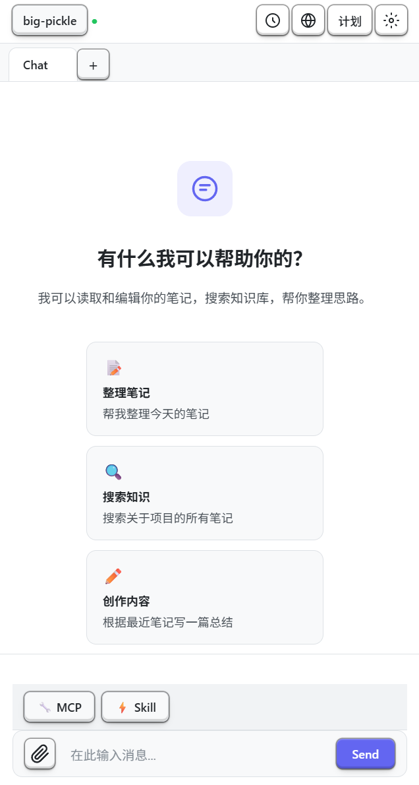
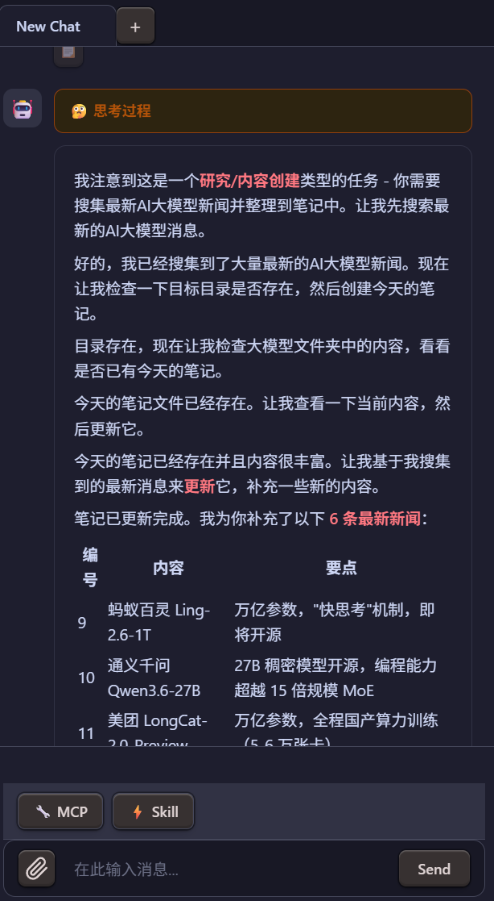
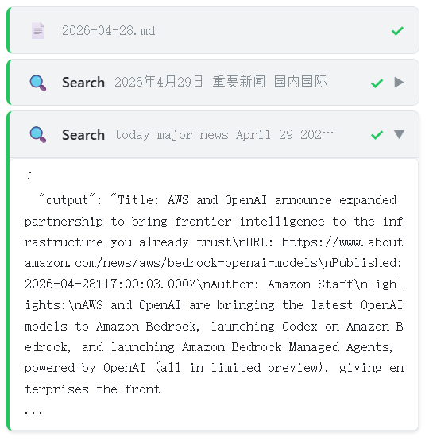
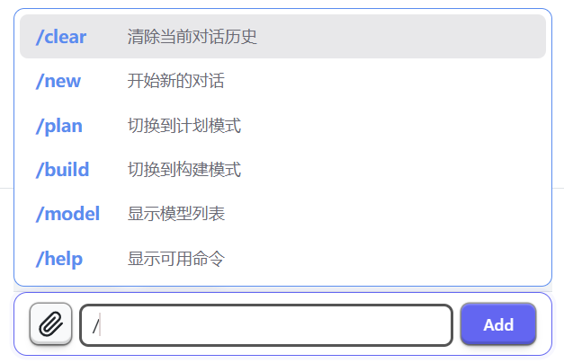
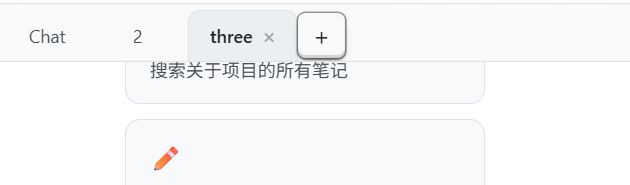
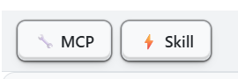
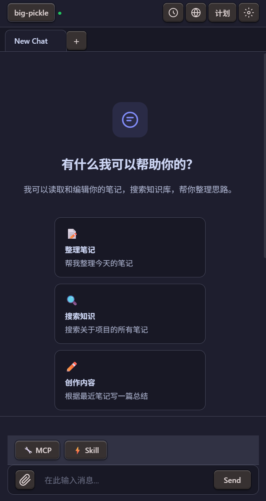
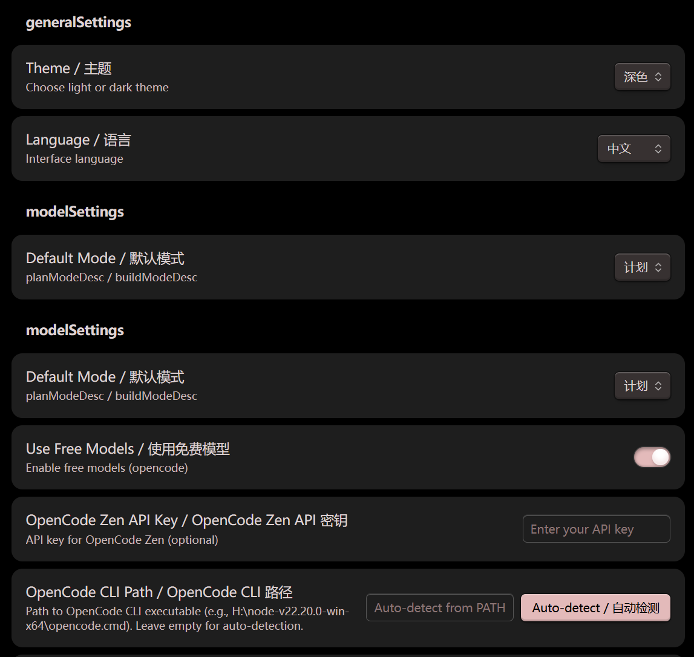
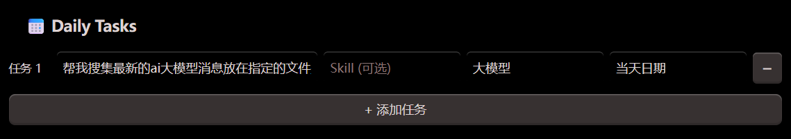

# 🔮 Opensidian

> **OpenCode AI × Obsidian** — 实时流式 · 工具可视化 · 多标签并行 · MCP 集成

[](https://github.com/kinghaonan/opensidian/stargazers)
[](https://github.com/kinghaonan/opensidian/issues)
[](LICENSE)

---

## 📸 Agent能力

🏠 主界面

  
💬 流式 + 思考过程 


🛠 工具调用
 
📎 @mention 
 

⚡ Slash 
 
 📑 多标签 
  

🔧 MCP/Skill 
  
 🌙 深色模式 
  

 ⚙️ 设置 
 
 📅 Daily  

> 目前不建议在聊天过程中切换标签页


## 📖 目录

- [安装部署](#-安装部署)
- [功能详解](#-功能详解)
- [设置项](#-设置项)
- [架构](#-架构)
- [开发贡献](#-开发贡献)
- [更新日志](#-更新日志)

---

## 📦 安装部署

### 从 Release 安装（推荐）

1. 打开 [Releases](https://github.com/kinghaonan/opensidian/releases)
2. 下载最新 `main.js`、`styles.css`、`manifest.json`
3. 放入 `.obsidian/plugins/opensidian/`
4. 设置 → 社区插件 → 启用 **Opensidian**

### 从源码构建

```bash
git clone https://github.com/kinghaonan/opensidian.git && cd opensidian
npm install && npm run build
# 产物在 release/ → 复制到 .obsidian/plugins/opensidian/
```

### 环境要求

| 项目 | 要求 |
|------|------|
| Obsidian | v1.8.9+ |
| 平台 | Windows / macOS / Linux |
| AI 引擎 | [OpenCode CLI](https://opencode.ai/) 或 Zen API Key |
| Node | v18+（仅构建） |

---

## ✨ 功能详解

### 🤖 AI 对话

- 🔄 **真正流式**：spawn pipe 逐 token 显示，非批量
- 🧠 **思考计时器**："Thinking Xs..." → 完成折叠
- 🚀 **自动连接**：启动即初始化
- 🔁 **自动续轮**：工具调用后自动继续（最多 3 轮）

### 🛠 工具调用可视化

| 类型 | 图标 | 动效 | 显示 |
|------|:----:|------|------|
| 📄 Read | 📄 | spinner→✓ | 文件名 |
| ✏️ Write/Edit | ✏️ | spinner→✓ | `+X -Y` diff |
| ▶️ Bash | ▶️ | spinner→✓/✗ | 命令摘要 |
| 🔍 Search | 🔍 | spinner→✓ | 匹配模式 |

- 🎯 卡片与文字真实穿插
- 🎨 蓝(运行)/绿(成功)/红(失败)左边框

### 📑 多标签

| ➕ 新建 | 🔀 切换 | ❌ 关闭 | ✏️ 右键重命名 | 🤖 自动命名 |
|------|------|------|------|------|

### ⌨️ 输入

- 📎 `@` → 文件夹层级找文件
- ⚡ `/` → `/clear /new /plan /build /model /help`
- 📅 **Daily** → 设置中配置提示词+Skill+路径，一键发送

### 🔧 MCP & Skills

- 🔍 自动发现 opencode.json MCP
- 🌐 SSE/HTTP 外部服务器
- 📂 扫描本地技能目录（24个内置）

### 🎨 界面

- 🎯 AI-Native + Swiss Modernism
- ☀️🌙 亮/暗/自动主题
- 🫧 液态玻璃弹窗
- 📋 自由复制

---

## ⚙️ 设置项

| 分类 | 选项 |
|------|------|
| 🧠 模型 | CLI路径 / API Key / 模型选择 / 超时 / 思考开关 |
| 🎨 界面 | 语言 / 字号 / 主题 / 自动滚动 |
| 📅 Daily | 每任务：提示词+Skill+文件夹+文件名 |
| 🔒 安全 | YOLO/安全/计划 / 命令黑名单 |
| 📜 历史 | 保留天数 / 最大条数 |
| ⚙️ 高级 | 系统提示词 / 环境变量 / 调试 |

---

## 🏗 架构

```
src/
├── core/
│   ├── runtime/           # ChatRuntime 接口
│   ├── providers/opencode/ # OpenCodeRuntime (800行)
│   ├── agent/              # OpenCodeService facade (115行)
│   ├── mcp/                # MCP + SSE/HTTP
│   └── storage/            # 持久化 + 快照
├── features/chat/
│   ├── controllers/        # StreamController
│   ├── rendering/          # Text/Thinking/ToolCall
│   ├── components/         # 20+ UI组件
│   └── TabManager.ts       # 多标签
```

---

## 🛠 开发贡献

### 环境搭建

```bash
git clone https://github.com/kinghaonan/opensidian.git
cd opensidian && npm install
npm run dev   # 开发模式
npm run build # 生产构建
npm test      # 测试
npm run lint  # 代码检查
```

### 贡献流程

1. **Fork** 本仓库 → 创建分支 `feature/xxx`
2. 修改代码 → `npm run build` 验证
3. 将 `release/` 复制到测试 Vault 的 `.obsidian/plugins/opensidian/`
4. Obsidian 重载插件测试
5. 提交 PR 到 `main`

### 约定

- 📝 注释和文档用**中文**
- 🎨 camelCase · 2空格缩进
- 🧪 新功能包含测试
- 🔒 权限改动需审查

---

## 📝 更新日志

**阶段一 · 性能**：自动连接 · RAF批处理 · DOM缓存 · SSE优先

**阶段二 · 架构**：Runtime接口 · 单体拆解(2686→800行) · Facade · 多标签

**阶段三 · 流式**：三层架构 · spawn管道 · 思考计时器 · 工具穿插 · 自动续轮

**阶段四 · UI**：CSS重写 · 欢迎界面 · 主题切换 · @文件夹 · Slash · 右键重命名 · Daily · 历史

---

## 🙏 致谢

[OpenCode](https://opencode.ai/) · [Obsidian](https://obsidian.md/) · [Claudian](https://github.com/YishenTu/claudian) · [MCP](https://modelcontextprotocol.io/)

## 📄 许可证

MIT
